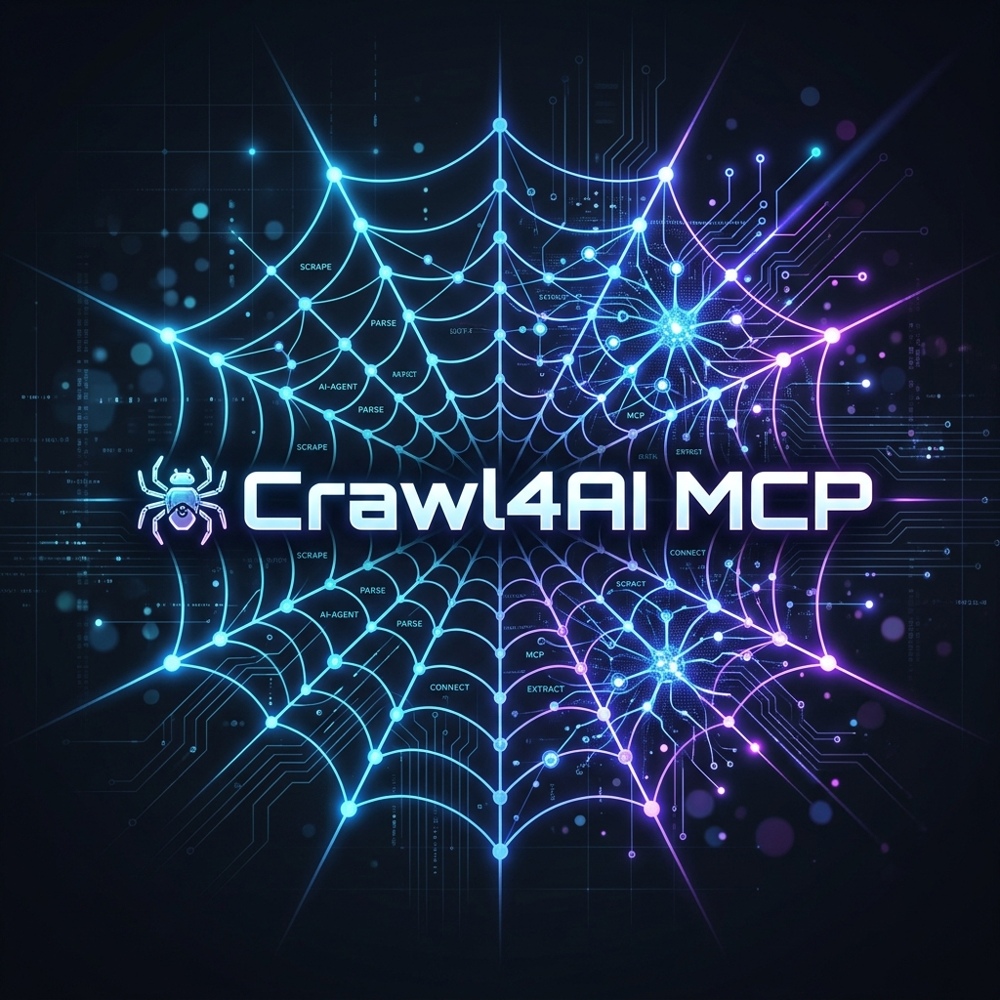

# Web Crawler MCP

[](../README.md) [](README.zh.md) [](README.hi.md) [](README.es.md) [](README.fr.md) [](README.ar.md) [](README.bn.md) [](README.ru.md) [](README.pt.md) [](README.id.md)


<div align="center">
  
</div>

Alat perayapan web (web crawling) canggih yang terintegrasi dengan asisten AI melalui MCP (Model Context Protocol). Proyek ini memungkinkan asisten AI untuk merayapi situs web, mengekstrak konten dinamis, menavigasi melalui tautan, dan menyimpan file Markdown terstruktur secara langsung.

## 📋 Fitur

- Integrasi asli dengan asisten AI melalui MCP
- Mengembalikan konten Markdown hasil scraping langsung ke AI
- Mengekstrak dan menampilkan tautan internal/eksternal untuk navigasi AI
- Perayapan situs web dengan kedalaman yang dapat dikonfigurasi
- Statistik hasil perayapan yang mendalam
- Penanganan kesalahan dan halaman tidak ditemukan
- **Kemampuan Scraping Lanjutan**:
  - **Mode Ajaib (Magic Mode)**: Melewati anti-bot (seperti Cloudflare) dan mensimulasikan perilaku browser yang sebenarnya
  - **Ekstraksi Tertarget (Targeted Extraction)**: Ambil hanya yang Anda butuhkan menggunakan pemilih (selector) CSS
  - **JavaScript Kustom**: Jalankan kode sebelum ekstraksi (klik, gulir, isi formulir)
  - **Sesi Persisten**: Simpan cookie dan status di seluruh permintaan untuk situs yang diautentikasi
  - **Dukungan SPA**: Tunggu pemilih CSS dinamis atau atur penundaan pra-ekstraksi secara eksplisit

## 🚀 Konfigurasi MCP

Cara termudah dan yang direkomendasikan untuk menggunakan alat ini adalah melalui `uvx`, yang secara otomatis mengambil dan menjalankan versi terbaru dari GitHub tanpa mengharuskan Anda untuk mengkloning repositori secara manual.

### Prasyarat

- [uv](https://github.com/astral-sh/uv) terinstal di sistem Anda.

### Penyiapan untuk Asisten AI (misalnya, Claude Desktop, Cline)

Tambahkan berikut ini ke file konfigurasi MCP Asisten AI Anda (misalnya, `cline_mcp_settings.json` atau `claude_desktop_config.json`):

> **Catatan untuk Pengguna Windows**: Sangat disarankan untuk menentukan `--python 3.12` untuk menghindari masalah kompilasi dengan dependensi tertentu.

```json
{
  "mcpServers": {
    "crawl": {
      "command": "uvx",
      "args": [
        "--python",
        "3.12",
        "--from",
        "git+https://github.com/laurentvv/crawl4ai-mcp",
        "crawl4ai-mcp"
      ],
      "disabled": false,
      "autoApprove": [],
      "timeout": 600
    }
  }
}
```

### Penting: Instalasi Browser

Perayap menggunakan Playwright untuk menangani konten dinamis. Anda harus menginstal browser yang diperlukan setelah menyiapkan alat:

```bash
uv run playwright install chromium
```

## 🖥️ Penggunaan

Setelah dikonfigurasi, Anda dapat menggunakan perayap dengan meminta asisten AI Anda untuk melakukan perayapan.

### Contoh Penggunaan dengan Claude/Cline

- **Perayapan Sederhana**: "Bisakah kamu merayapi situs example.com dan memberi saya ringkasannya?"
- **Perayapan dengan Opsi**: "Bisakah kamu merayapi https://example.com dengan kedalaman 3 dan sertakan tautan eksternal?"
- **Konten Dinamis**: "Rayapi aplikasi React ini dan tunggu pemilih `.main-content` dimuat."
- **Bypass Proteksi**: "Rayapi example.com tetapi gunakan 'mode ajaib' (magic mode) untuk melewati perlindungan anti-bot."
- **Ekstraksi Tertarget**: "Rayapi situs docs tetapi ekstrak hanya konten yang cocok dengan pemilih CSS `h1, p.lead`."

## 🛠️ Parameter yang Tersedia (Alat MCP)

Alat `crawl` menerima parameter berikut:

| Parameter | Tipe | Deskripsi | Nilai Default |
|-----------|------|-------------|---------------|
| `url` | string | URL untuk dirayapi (diperlukan) | - |
| `max_depth` | integer | Kedalaman perayapan maksimum | 2 |
| `include_external` | boolean | Sertakan tautan eksternal | false |
| `verbose` | boolean | Aktifkan output mendalam | true |
| `wait_for_selector` | string | Pemilih CSS untuk ditunggu sebelum mengekstrak konten. Berguna untuk aplikasi satu halaman (SPA). | None |
| `return_content` | boolean | Apakah akan mengembalikan konten yang diekstrak langsung dalam respons MCP (dipotong menjadi 50rb karakter jika perlu). | true |
| `output_file` | string | Jalur file output | dibuat secara otomatis |
| `magic` | boolean | Aktifkan mode ajaib untuk melewati anti-bot dan mensimulasikan browser sebenarnya | false |
| `css_selector` | string | Pemilih CSS spesifik untuk mengekstrak hanya elemen yang ditargetkan dari halaman | None |
| `js_code` | string | Kode JavaScript kustom untuk dijalankan pada halaman sebelum ekstraksi | None |
| `session_id` | string | Pengidentifikasi sesi persisten untuk menyimpan cookie dan status browser di seluruh permintaan | None |
| `delay_before_return_html` | number | Penundaan dalam detik untuk menunggu sebelum mengekstrak HTML (berguna untuk halaman JS yang berat) | None |

## 👨‍💻 Pengembangan

Jika Anda ingin memodifikasi perayap atau menjalankannya secara lokal:

1. Kloning repositori ini:
```bash
git clone https://github.com/laurentvv/crawl4ai-mcp
cd crawl4ai-mcp
```

2. Instal dependensi menggunakan `uv`:
```bash
uv sync
```

3. Uji server MCP secara lokal menggunakan MCP Inspector resmi:
```bash
npx -y @modelcontextprotocol/inspector uv run crawl4ai-mcp
```

4. Jalankan suite pengujian otomatis:
```bash
uv run pytest tests/
```

5. Jalankan server MCP secara langsung (untuk penggunaan standar):
```bash
uv run crawl4ai-mcp
```

## 🤝 Kontribusi

Kontribusi sangat diterima! Jangan ragu untuk membuka issue atau mengirimkan pull request.

## 📄 Lisensi

Proyek ini dilisensikan di bawah Lisensi MIT - lihat file LICENSE untuk detailnya.
